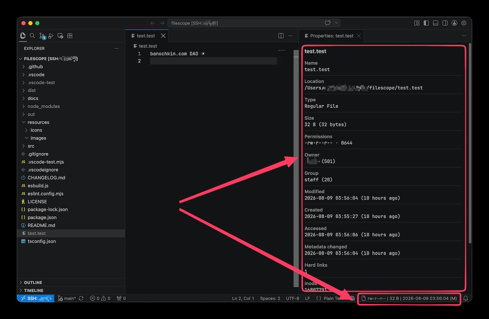

# FileScope

A file is more than its name and its size. FileScope keeps the properties you care about in the status bar, and puts everything the file system knows one click away.



## Why another file properties extension

Most of them stop at size and modification time. FileScope answers the questions that actually come up:

**Who owns this file?** `black (501)` and `staff (20)`, not a pair of bare numbers you then have to look up. Names are resolved through the system's own account database — which matters on macOS, where local users live in Directory Services and never appear in `/etc/passwd`.

**When was it created?** Creation time is its own property, never quietly substituted with the metadata change time. Where the file system genuinely records none, the property is absent rather than filled with a fake.

**What are the permissions, exactly?** `-rw-r--r-- · 0644`, with setuid, setgid and sticky bits folded into the execute positions the way `ls -l` writes them — so a `4755` never looks like a `755`.

**Does any of this survive on a remote host?** Yes. FileScope runs where the files are, so over Remote-SSH, WSL, Dev Containers and Codespaces it reports the remote file system rather than your laptop's.

## The status bar

You choose what appears and in which order, through `filescope.statusBar.items`:

```jsonc
"filescope.statusBar.items": ["permissions", "owner", "size", "mtime"]
// -rw-r--r-- | black | 1.22 KiB | 2026-08-09 03:56:04 (M)
```

Available entries are `type`, `permissions`, `owner`, `group`, `size`, `atime`, `mtime`, `ctime` and `birthtime`. Hovering shows a summary; clicking opens the full panel.

The display keeps up on its own. Saving the file, changing it from a terminal, a rebase touching it, a `chmod` in another window — all of it refreshes without you asking.

## The details panel

Everything `stat` reports: type, size in both human and exact form, permissions in symbolic and octal, ownership, all four timestamps with relative ages, hard link count, inode, device, allocated blocks and preferred I/O block size. Symbolic links report their target and whether it still resolves.

The layout follows the panel width — stacked in a narrow column beside the editor, two columns when there is room.

## Settings

| Setting | Default | Description |
| --- | --- | --- |
| `filescope.statusBar.enabled` | `true` | Show file properties in the status bar. |
| `filescope.statusBar.items` | `["permissions", "size", "mtime"]` | Which properties to show, in order. |
| `filescope.statusBar.alignment` | `"right"` | Side of the status bar. |
| `filescope.statusBar.priority` | `100` | Position within that side; higher moves further left. |
| `filescope.statusBar.separator` | `" \| "` | Separator between properties. |
| `filescope.statusBar.showLabels` | `true` | Append `(A)`, `(M)`, `(C)`, `(B)` to timestamps. |
| `filescope.size.unit` | `"iec"` | `iec` for KiB/MiB (1024), `si` for kB/MB (1000). |
| `filescope.time.format` | `"YYYY-MM-DD HH:mm:ss"` | [Day.js format tokens](https://day.js.org/docs/en/display/format). |
| `filescope.time.relative` | `false` | Show status bar timestamps as relative time. |
| `filescope.ownership.resolveNames` | `true` | Resolve `uid`/`gid` to names. |
| `filescope.details.followActiveFile` | `true` | Keep an open panel in sync with the active file. |

Two commands are contributed, both available from the Command Palette: **FileScope: Show File Properties** and **FileScope: Refresh File Properties**.

## Install

```bash
code --install-extension banochkin.filescope
```

Or find **FileScope** in the Extensions view.

Working on a remote host? Install it on the remote side — the Extensions view offers **Install in SSH: …** for exactly this. A copy installed only locally will stay dormant, because the properties this extension exists to show are the ones only the machine holding the file can answer.

## Platform notes

**Creation time.** Not every file system records one. APFS and NTFS do; several Linux file systems either do not, or report the metadata change time in its place, which is indistinguishable from the real thing at the API level.

**Windows.** There are no POSIX permission bits or ownership to report, so those entries are skipped rather than filled with a synthesised mode that says nothing about the actual ACL. A read-only row takes their place, and the inode becomes the file index.

**Ownership lookups** cost one short-lived process per `uid`/`gid` pair, cached afterwards. Set `filescope.ownership.resolveNames` to `false` to keep the raw numbers and skip it entirely.

**Virtual workspaces.** When the file system is a provider rather than a disk — GitHub Repositories, for instance — only type, size and the timestamps that provider reports are available. The panel says so plainly instead of rendering the absent fields as zeroes.

## Requirements

VS Code [`1.96.0`](https://code.visualstudio.com/updates/v1_96) or later.

## Development

```bash
npm install
npm run watch    # esbuild and tsc, both watching
npm run lint
npm test
```

<kbd>F5</kbd> launches an Extension Development Host.

## Credits

FileScope began as a fork of [dsyx/vsc-file-properties](https://github.com/dsyx/vsc-file-properties) by Yaoxing Shan and keeps its MIT licence. The rewrite that followed is documented in [CHANGELOG.md](CHANGELOG.md).
